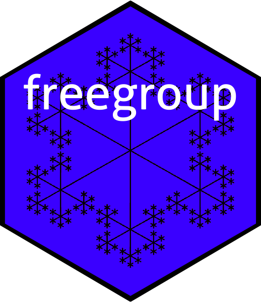

<!-- README.md is generated from README.Rmd. Please edit that file -->

```{r setup, include = FALSE}
knitr::opts_chunk$set(
  collapse = TRUE,
  comment = "#>",
  fig.path = "man/figures/README-",
  out.width = "100%"
)
```




<!-- badges: start -->
[](https://cran.r-project.org/package=freegroup)
[](https://codecov.io/gh/RobinHankin/freegroup/branch/master)
<!-- badges: end -->

# Overview

The `freegroup` package provides functionality for working with
the free group in R.  A detailed vignette is provided in the package.
Informally, the _free group_ is the set $X$ of _words_ that are
objects like $W=c^{-4}bb^2aa^{-1}ca$, with a group operation of string
juxtaposition.  Usually one works only with words that are in
``reduced form'', which has successive powers of the same symbol
combined, so $W$ would be equal to $c^{-4}b^3ca$; see how $b$ appears
to the third power and the $a$ term in the middle has vanished.

The group operation of juxtaposition is formally indicated by $\circ$,
but this is often omitted in algebraic notation; thus, for example
$a^2b^{-3}c^2\circ c^{-2}ba =a^2b^{-3}c^2c{^-2}ba =a^2b^{-2}ba$.

# Installation

You can install the released version of freegroup from [CRAN](https://CRAN.R-project.org) with:

```{r, message=FALSE}
# install.packages("freegroup")  # uncomment this to install the package
library("freegroup")
```

# The `freegroup` package in use

Function `rfree()` generates a vector of random free group
elements, giving quick "get you going" examples:

```{r, echo=FALSE}
set.seed(0)
```

```{r}
a <- rfree(10,5)
a
b <- as.free('x')
```

Then we can perform various operations on these vectors:

```{r}
a+b
a-b
a^b
```

There are a number of package functions that work in a vectorized way:

```{r}
sum(a)
```

The package also supports extraction and replacement:

```{r}
a[3:9] <- as.free('xy')
a
```

Various simple elements can be created:

```{r}
alpha(1:10)
abc(1:5)
```


# References

- Wikipedia contributors, "Free group," _Wikipedia, the free
  encyclopedia_, 4 June 2019.
  [https://en.wikipedia.org/w/index.php?title=Free_group&oldid=900295259]

# Further information

For more detail, see the package vignette

`vignette("freegroup")`
